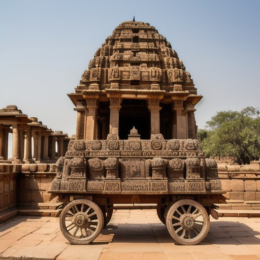
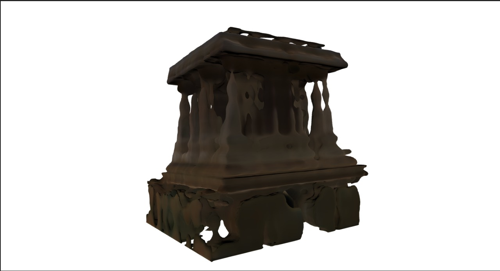

# 🏛️ 3D Reconstruction of Lost Hampi Monuments  
_Rebuilding the past with the power of AI_

---

## 📌 Overview  
This project focuses on **reconstructing the lost architectural marvels of Hampi** in stunning 3D. By combining cutting-edge AI techniques like Retrieval-Augmented Generation (RAG), generative models, and 3D point cloud generation, we aim to **digitally revive historical heritage** that no longer exists in its physical form.

---

## 🛠️ Installation  

1. Clone the repository:  
   ```bash
   git clone https://github.com/Sameerbeedi/3D-Reconstruction-of-Monuments.git
   cd 3D-Reconstruction-of-Monuments

---
2. Install dependencies
```bash
pip install -r requirements.txt
```

## 🛠️ Project Workflow  

### 🔍 1. RAG Implementation  
Extract rich contextual data about lost Hampi monuments from various online sources using **Retrieval-Augmented Generation**. The data is stored efficiently using **ChromaDB** for easy querying and access.

### ✍️ 2. Prompt Engineering  
Using the collected information, we generate **question-answer pairs** related to lost Hampi architecture. These prompts help enrich our dataset and guide image generation with **precise architectural context**.

### 🖼️ 3. Text-to-Image Generation  
Descriptions and existing Hampi datasets are fed into a **text-to-image generation model** to create **high-resolution 2D visualizations** of the lost structures.<br>
We use the **Realistic_Vision_V5.1_noVAE** model, known for its photorealistic outputs, to generate these images.<br>
Here is an example of a reconstructed stone chariot:<br>
**Note**: The image has an accurate reconstructed top but must be fine-tuned to generate more accurate complete reconstruction.<br>


### 🧱 4. 2D to 3D Conversion  
The generated 2D images are transformed into **3D models**, bringing these historical wonders to life in immersive, digital 3D formats.  
An image of the stone chariot was used to generate a 3D model using **Shap-E**. While this provides a good high-level design of the monument, it fails to capture the intricate architectural details due to its limited complexity.  
Once we have access to higher computational resources, we plan to use a more advanced model to generate highly detailed 3D reconstructions.<br>


## Future Improvements

1. **Train on a Larger Dataset**: Expand the dataset to include a diverse range of images capturing various architectural styles. This will help improve the model's ability to generate accurate and detailed reconstructions.

2. **Use Zero123 for Multi-Angle Generation**: Leverage **Zero123** to generate multiple angles of an image. This will enable the creation of more comprehensive 3D point cloud data, capturing intricate architectural details.

3. **Text-to-3D Generation**: Incorporate advanced text-to-3D generation models to directly generate 3D structures from textual descriptions, reducing dependency on intermediate 2D images.

4. **Fine-Tuning for High Accuracy**: Fine-tune the pipeline with high-resolution datasets and advanced models to achieve highly accurate and detailed 3D reconstructions of monuments.


